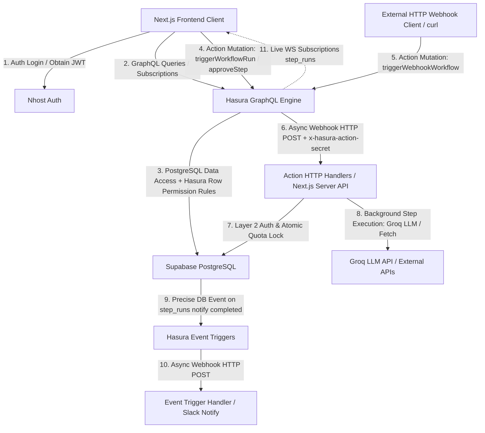
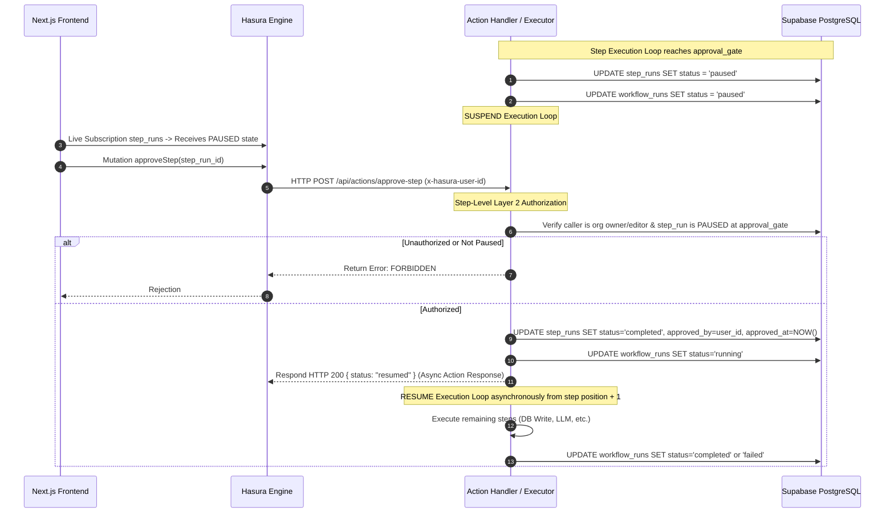

# AI Agent Workflow Builder — System Architecture & Design

## 1. System Overview & Technology Stack Integration

This project is a multi-tenant AI workflow automation platform (n8n-style) with strict organization isolation, Hasura row-level authorization rules, server-side step-level authorization, approval gate pause/resume, workflow execution engine, retries, atomic quota enforcement, Hasura Actions, Event Triggers, and GraphQL subscriptions.

### Technology Feasibility & Hosting Matrix

| Component | Provider / Hosting | Integration & Connection Details |
| :--- | :--- | :--- |
| **Database** | **Supabase PostgreSQL** | Primary PostgreSQL relational database. Hasura connects via direct PostgreSQL pooler connection string (`DATABASE_URL`). |
| **GraphQL Engine** | **Hasura GraphQL Engine** | Pointed to Supabase PostgreSQL. Evaluates Hasura row-level permission rules, exposes GraphQL API, Hasura Actions, and Event Triggers. |
| **Authentication** | **Nhost Auth** | Issues JWTs with Hasura session claims (`x-hasura-user-id`, `x-hasura-allowed-roles`, `x-hasura-default-role`). Hasura validates token using `HASURA_GRAPHQL_JWT_SECRET`. |
| **Action & Event Handlers** | **Serverless HTTP Endpoints / Next.js API Routes** | Hosted on Next.js server (`/api/actions/*`, `/api/events/*`). Invoked exclusively via HTTP POST by Hasura Engine with `x-hasura-action-secret`. Handlers return responses asynchronously. |
| **Frontend UI** | **Next.js (React + TypeScript)** | App router/Pages, Nhost Auth React SDK (`@nhost/react`), GraphQL Client (Apollo/Urql) with WebSocket Subscriptions (`graphql-ws`). |

---

## 2. Distinction Between Service Components

To ensure zero ambiguity, the system strictly separates these execution primitives:

1. **Hasura Action**: Hasura GraphQL schema definition (Mutation/Query) exposed to GraphQL clients or webhooks. Hasura receives the request, verifies JWT session headers, and forwards a payload to the Action HTTP Handler.
2. **Action HTTP Handler**: Asynchronous web endpoint (`/api/actions/trigger-workflow`, `/api/actions/approve-step`, `/api/actions/webhook-trigger`) that executes server-side business logic, performs Layer 2 authorization, responds immediately to Hasura, and dispatches background step execution loops.
3. **Event Trigger**: Database trigger defined in Hasura Metadata watching PostgreSQL mutations (`INSERT`/`UPDATE` on `step_runs`). When a row matching precise criteria (e.g. `type = 'notify'` AND `status = 'completed'`) occurs, Hasura asynchronously invokes the Event Trigger HTTP Handler.
4. **Event Trigger HTTP Handler**: Internal HTTP endpoint (`/api/events/notify`) that processes database change payloads and sends notifications (e.g., Slack webhook / Email) idempotently.
5. **Normal Next.js API Route**: Standard client-facing Next.js endpoints (e.g., health check, static file serving) — NOT used for privileged workflow mutations.

---

## 3. Architecture Flow Diagrams

### High-Level Architecture Diagram


---

## 4. End-to-End Execution & Integration Flows

### B. Nhost → JWT → Hasura Authentication Flow

* **JWT Issuer**: `https://<subdomain>.auth.<region>.nhost.run/v1` (Nhost Auth Service)
* **Signing Algorithm**: `RS256` (using Nhost JWKS URL `https://<subdomain>.auth.<region>.nhost.run/v1/open-api/jwks.json`) or `HS256` key.
* **Hasura JWT Configuration (`HASURA_GRAPHQL_JWT_SECRET`)**:
  ```json
  {
    "type": "RS256",
    "jwk_url": "https://<subdomain>.auth.<region>.nhost.run/v1/open-api/jwks.json"
  }
  ```
* **Claims Structure (`https://hasura.io/jwt/claims`)**:
  - `x-hasura-user-id`: `<user-uuid>` (corresponds to user ID in auth.users)
  - `x-hasura-default-role`: `"user"`
  - `x-hasura-allowed-roles`: `["user"]`
* **Single Hasura Role Design**: All authenticated users use the standard Hasura role `user`. Detailed application organization roles (`owner`, `editor`, `viewer`) are stored in `org_members.role` in PostgreSQL and dynamically evaluated inside Hasura permission rules and server-side Action handlers.

---

### C. Database & Multi-Tenant Isolation Model (Layer 1 Authorization)

Every database query and mutation executed via Hasura enforces Hasura row-level permission rules using the `org_members` junction table.

```text
organizations (id, name, quota_limit, quota_used, quota_period)
 ├── org_members (id, org_id, user_id, role: 'owner'|'editor'|'viewer')
 └── workflows (id, org_id, name, description, created_by)
       ├── workflow_steps (id, workflow_id, position, type, name, config)
       ├── workflow_triggers (id, workflow_id, type, config, enabled)
       └── workflow_runs (id, workflow_id, trigger_type, status, error, created_by)
             └── step_runs (id, workflow_run_id, workflow_step_id, status, input, output, attempt_count, approved_by, approved_at)
```

#### Hasura Row-Level Permission Rules Across All Tables:
* **`workflows` Table Permission Rule**:
  ```json
  {
    "org_id": {
      "_in": {
        "_select": {
          "table": {"schema": "public", "name": "org_members"},
          "columns": ["org_id"],
          "where": {
            "user_id": {"_eq": "X-Hasura-User-Id"}
          }
        }
      }
    }
  }
  ```
* **Child Tables Permission Rules (`workflow_steps`, `workflow_triggers`, `workflow_runs`)**:
  - Filtered through parent workflow relationship:
    ```json
    {
      "workflow": {
        "org_id": {
          "_in": {
            "_select": {
              "table": {"schema": "public", "name": "org_members"},
              "columns": ["org_id"],
              "where": {
                "user_id": {"_eq": "X-Hasura-User-Id"}
              }
            }
          }
        }
      }
    }
    ```
* **Grandchild Table (`step_runs`)**:
  - Filtered through run -> workflow relationship:
    ```json
    {
      "workflow_run": {
        "workflow": {
          "org_id": {
            "_in": {
              "_select": {
                "table": {"schema": "public", "name": "org_members"},
                "columns": ["org_id"],
                "where": {"user_id": {"_eq": "X-Hasura-User-Id"}}
              }
            }
          }
        }
      }
    }
    ```

**ID Guessing Protection Guarantee**: If an Org B user queries an Org A workflow or step UUID directly (e.g., `workflow_by_pk(id: "org-a-uuid")`), Hasura evaluates the `org_members` permission rule. Since user B is not in Org A's `org_members`, the query evaluates to false and returns `null` or 0 rows.

---

### D. Hasura Action Flow (`triggerWorkflowRun`)

1. GraphQL client submits mutation `triggerWorkflowRun(workflow_id: UUID!)`.
2. Hasura verifies caller's JWT, validates session header `x-hasura-user-id`, and issues HTTP POST to `/api/actions/trigger-workflow` with `x-hasura-action-secret`.
3. The Action HTTP handler:
   - Evaluates **Layer 2 Authorization** (verifies user is `owner` or `editor` in target org).
   - Executes **Atomic Quota Lock** (increments `quota_used` if available).
   - Inserts `workflow_runs` row with `status = 'running'`.
   - **Responds immediately to Hasura** with `{ run_id: "...", status: "started" }` to prevent HTTP connection hanging.
   - Spawns background workflow step execution engine.

---

### E. Hasura Webhook Action Flow (`triggerWebhookWorkflow`)

1. Webhook trigger is defined as an explicit Hasura Action Mutation `triggerWebhookWorkflow(workflow_id: UUID!, trigger_secret: String!)`.
2. An external system (e.g. `curl` or third-party webhook producer) calls Hasura's GraphQL / Action endpoint.
3. Hasura forwards the request payload to Action HTTP Handler `/api/actions/webhook-trigger`.
4. The Action HTTP Handler performs strict verification:
   - Verifies **Workflow exists**.
   - Verifies **Webhook trigger entry exists** (`type = 'webhook'`) for the target workflow.
   - Verifies **Trigger is enabled** (`enabled = true`).
   - Verifies **Supplied `trigger_secret` matches** `workflow_triggers.config->>'secret'`.
   - Verifies **Workflow can be triggered** (valid active state).
   - Verifies **Organization quota is available** (`quota_used < quota_limit`).
5. Upon successful validation, the handler reserves quota atomically, initializes `workflow_runs` (`trigger_type = 'webhook'`), responds immediately to Hasura, and dispatches background step execution.

---

### F. Hasura Event Trigger Flow (`notify`)

1. **Precise Condition**: The Event Trigger is configured in Hasura Metadata on table `step_runs` watching `UPDATE` operations.
2. **Filter Rule**: Fires ONLY when `step_runs.workflow_step.type = 'notify'` AND `step_runs.status = 'completed'` (transitioned from `running`).
3. Hasura asynchronously emits a single webhook POST to `/api/events/notify`.
4. The handler verifies the notification payload, checks idempotency tracking in DB, and dispatches the notification to the target webhook (e.g., Slack Incoming Webhook).

---

### G. Approval Gate Pause & Resume Flow



---

### H. Quota Semantics & Atomic Enforcement

* **Quota Semantics**: Quota represents **execution reservations / starts**. Quota usage is incremented immediately when a workflow run is initiated, regardless of eventual step completion or failure.
* **Atomic PostgreSQL Locking Statement**:
  ```sql
  UPDATE organizations 
  SET quota_used = quota_used + 1,
      updated_at = NOW()
  WHERE id = $org_id 
    AND quota_used < quota_limit
  RETURNING quota_used, quota_limit;
  ```
* **Concurrency Guarantee**: PostgreSQL row-level locks on `organizations` guarantee that concurrent run requests serialize on the `UPDATE`. If `quota_used >= quota_limit`, 0 rows are updated. The Action handler checks updated row count — if 0 rows return, execution is immediately rejected before any step runs are created.

---

### I. Layer 1 vs. Layer 2 Authorization Matrix

| Control Point | Enforced By | Mechanism & Rule |
| :--- | :--- | :--- |
| **Workflow / Run / Step Read & Query** | **Layer 1 (Hasura Permission Rules)** | User can only query rows where `org_id` exists in `org_members` for `x-hasura-user-id`. |
| **Direct PK ID Guessing** | **Layer 1 (Hasura Permission Rules)** | Direct PK lookup returns `null`/empty result for unauthorized org IDs. |
| **Role-Based Workflow Execution** | **Layer 2 (Action Handler)** | Action handler extracts `x-hasura-user-id`, queries `org_members.role`, rejecting `viewer` role callers. |
| **Owner-Only Step Creation / Edit** | **Layer 2 (Action / DB Handler)** | When creating/updating steps, server rejects `db_write`, `notify`, `webhook` if caller `role != 'owner'`. |
| **Approval Gate Authorization** | **Layer 2 (Action Handler)** | `approveStep` handler verifies approver's org membership matches workflow org, role is `owner` or `editor`, and target step is `paused`. |

---

### J. Explicit Security Acceptance Test Suite

| Test Case ID | Test Target | Action / Query | Expected Result |
| :--- | :--- | :--- | :--- |
| **SEC-01** | Cross-Org ID Guessing | Org B user queries Org A workflow UUID directly | Hasura returns `null` (0 rows) |
| **SEC-02** | Cross-Org Step Run Guessing | Org B user queries Org A `step_run` UUID directly | Hasura returns `null` (0 rows) |
| **SEC-03** | Cross-Org Trigger Attempt | Org B user invokes `triggerWorkflowRun(org_a_workflow_id)` | Action Handler returns `FORBIDDEN` |
| **SEC-04** | Cross-Org Approval Attempt | Org B user invokes `approveStep(org_a_step_run_id)` | Action Handler returns `FORBIDDEN` |
| **SEC-05** | Editor Owner-Only Step (`db_write`) | Org A editor attempts creating/executing `db_write` step | Server handler returns `FORBIDDEN` |
| **SEC-06** | Editor Owner-Only Step (`notify`) | Org A editor attempts creating `notify` step | Server handler returns `FORBIDDEN` |
| **SEC-07** | Editor Owner-Only Trigger (`webhook`) | Org A editor attempts creating `webhook` trigger | Server handler returns `FORBIDDEN` |
| **SEC-08** | Owner Privileged Operations | Org A owner performs all of SEC-05 to SEC-07 | Success |
